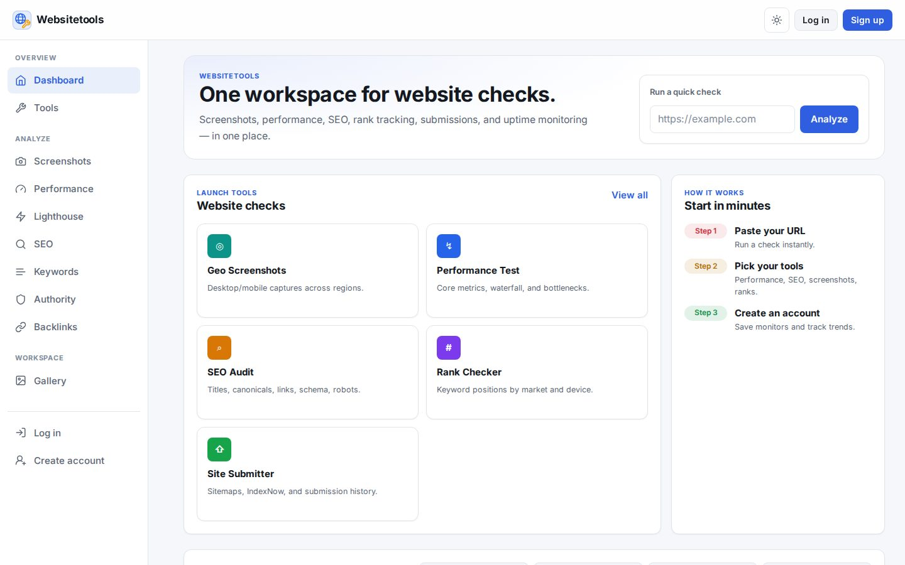

# WebsiteTools - One workspace for website checks

**Website: [websitetools.io](https://websitetools.io)**  |  Project page: https://asansanwal.github.io/websitetools.io/

Screenshots, performance, SEO, rank tracking, submissions and uptime monitoring in one place. Paste a URL, run a check instantly, then create an account to save monitors and track trends.

## Highlights

- **Geo screenshots** - Desktop and mobile captures across regions.
- **Performance test** - Core metrics, waterfall and bottlenecks, Lighthouse included.
- **SEO audit** - Titles, canonicals, links, schema and robots.
- **Rank checker** - Keyword positions by market and device; keywords, authority and backlinks.
- **Site submitter** - Sitemaps, IndexNow and submission history.
- **Monitors** - Checks run on your configured intervals with a status dashboard.

## More projects

- [QuickPod](https://quickpod.io) - Affordable GPU and CPU rentals ([project page](https://asansanwal.github.io/quickpod.io/))
- [QuickOpen](https://quickopen.ai) - 100% AI-built open source software ([project page](https://asansanwal.github.io/quickopen.ai/))
- [Quick OS](https://quickopen.ai/aiquick-os) - A complete operating system that is actually yours ([project page](https://asansanwal.github.io/quickos/))
- [Common Screens](https://commonscreens.com) - Open web screenshot data ([project page](https://asansanwal.github.io/commonscreens.com/))
- [APIQuick](https://apiquick.io) - API marketplace for metered API integrations ([project page](https://asansanwal.github.io/apiquick.io/))
- [AIQuick](https://aiquick.io) - AI image, video and chat generation ([project page](https://asansanwal.github.io/aiquick.io/))
- [QuickAIHub](https://quickaihub.io) - Ship AI faster. Sell what you build. ([project page](https://asansanwal.github.io/quickaihub.io/))
- [QuickDigital](https://quickdigital.io) - Premium digital goods and services marketplace ([project page](https://asansanwal.github.io/quickdigital.io/))
- [Vansha](https://vansha.com) - Free family genealogy portal ([project page](https://asansanwal.github.io/vansha.com/))
